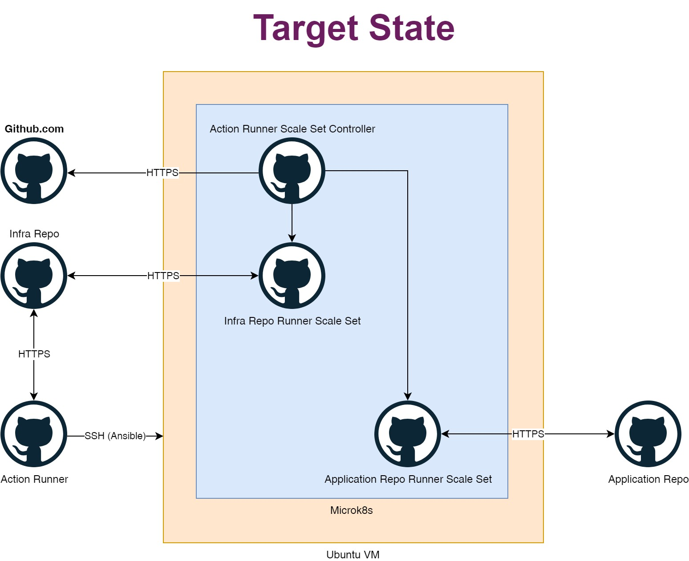
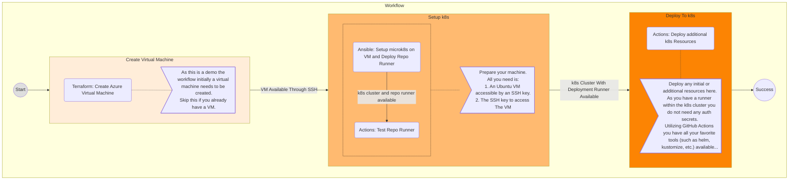

# k8s-for-small-teams

Demo for k8s usage in small teams.

The repository contains an ansible playbook to setup a fully working k8s cluster on ubuntu with GitHub Action Runners deployed for the Repository itself and an additional application Repository.

The repository contains workflows to setup the k8s cluster:

<!-- markdownlint-disable -->

> [!IMPORTANT]
> The initial setup of a virtual machine in azure is just for demo purpose. If you plan to run your application in Azure consider using [Azure Kubernetes Service](https://learn.microsoft.com/de-de/azure/aks/what-is-aks), [Azure Container Instances](https://learn.microsoft.com/en-us/azure/container-instances/container-instances-overview) or [Azure Container Apps](https://learn.microsoft.com/en-us/azure/container-apps/overview).

> [!TIP]
> All workflow steps can be customized. Have a look at the terraform variables, the ansible variables or just deploy your own k8s resources in the last step.

<!-- markdownlint-enable -->

## Quickstart

Deploy to azure using thw workflow 

Do not forget to clean up your deployment using the workflow 

### Access Grafana

The demo will deploy a monitoring solution using prometheus/grafana.

The grafana dashboard will be available under the following endpoint:

URL: [https://monitoring-demo-k8s-for-small-teams.northeurope.cloudapp.azure.com](https://monitoring-demo-k8s-for-small-teams.northeurope.cloudapp.azure.com)

Default User: admin

Default Password: prom-operator
